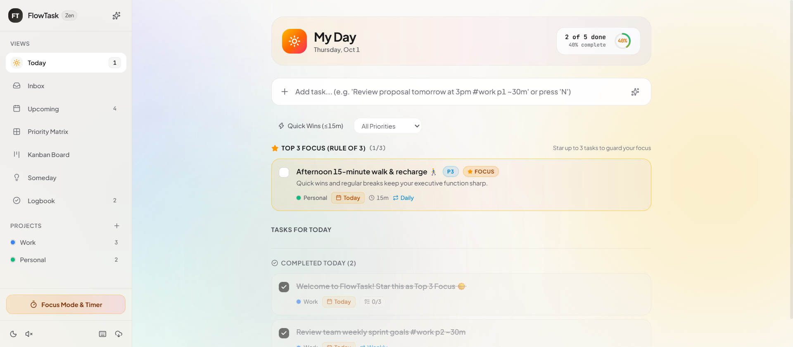
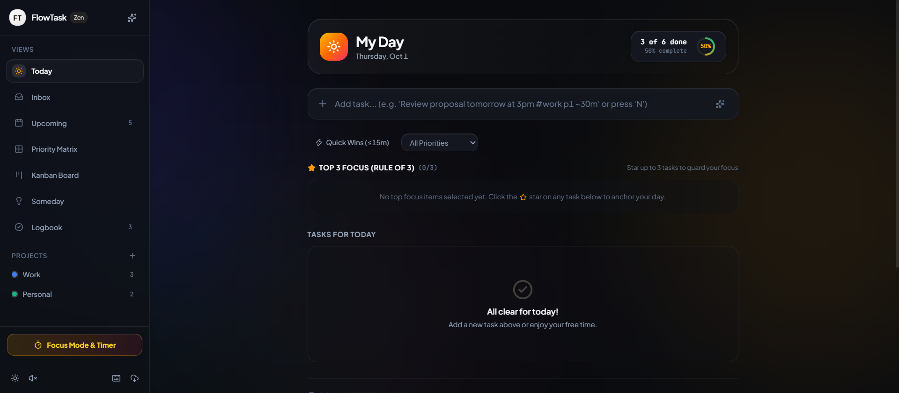
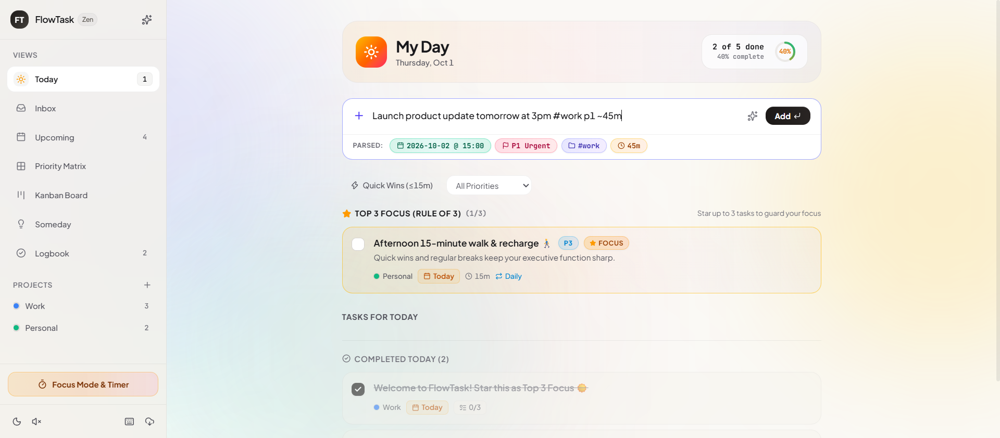
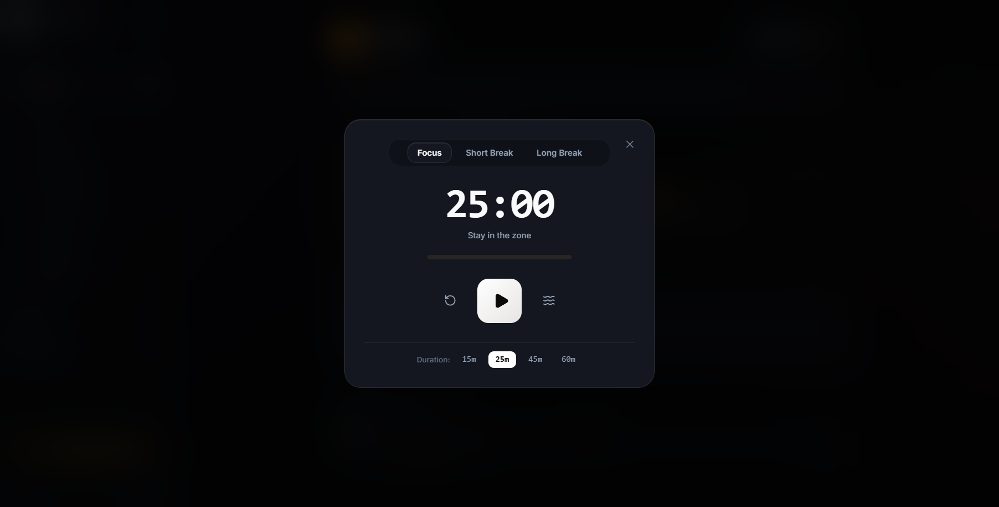
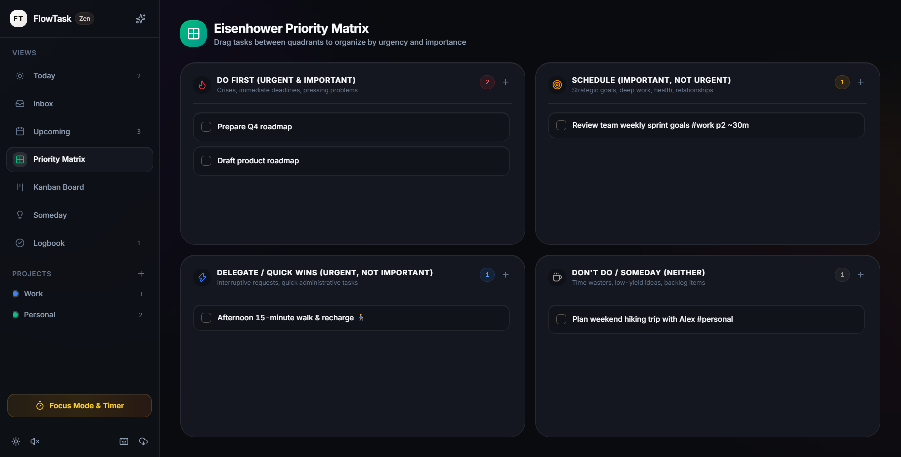
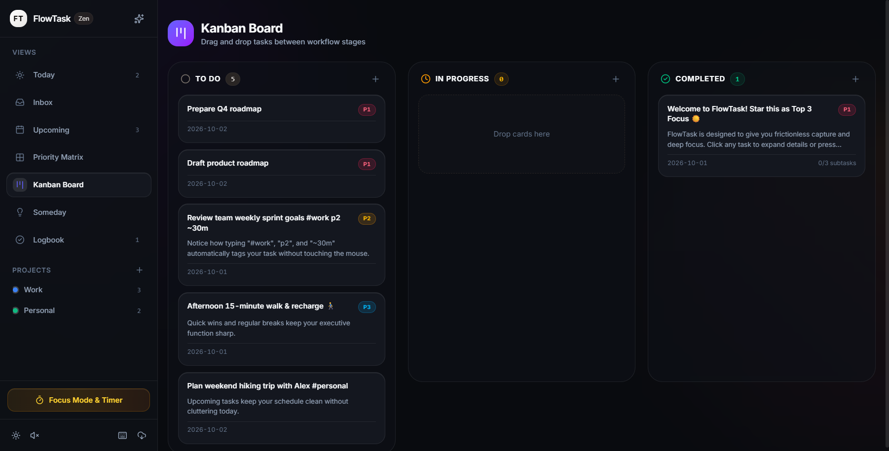
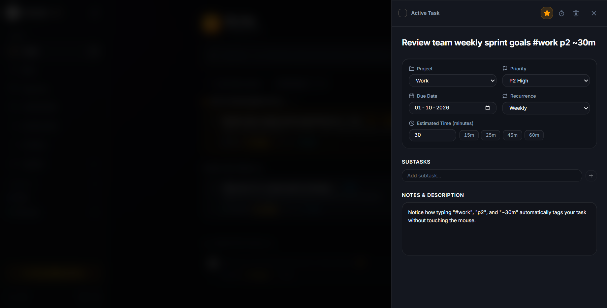
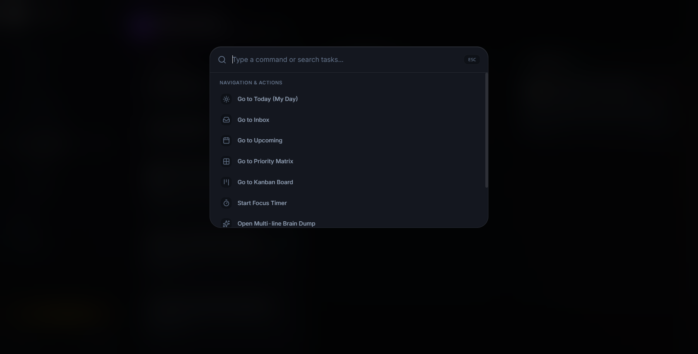

# FlowTask ⚡

> **Simple to Use, Deeply Effective, Psychology-Informed Task Planner**  
> *Crafted with the visual elegance of Things 3, the velocity of Linear, and the ambient warmth of Amie.*

---

## 🌟 Overview

**FlowTask** is an executive-grade personal task management system designed to eliminate productivity paralysis. Built on cognitive psychology principles, FlowTask helps you capture ideas instantly, guard your daily focus with the **Rule of 3**, and prevent the dreaded "overdue shame spiral" through gentle morning triage.

---

## ✨ Visual Showcase

### ☀️ Light Mode — Luminous Warm Alabaster & Aurora Mesh
*Bathed in gentle morning daylight with organic 4-orb breathing aurora mesh, Plus Jakarta Sans typography, and dual-gradient progress gauge.*



### 🌙 Dark Mode — 4-Tiered Obsidian Ladder
*Deep space obsidian (`#090B0F`), moonlight hairline borders, and iridescent amber-gold Rule of 3 Focus card.*



---

## 🎯 Core Features & Cognitive Philosophy

### 1. ⚡ Zero-Friction Capture (Smart NLP Omnibar)
Type naturally without touching the mouse. Built-in `chrono-node` natural language processing parses dates, times, projects, priorities, and duration estimates in real time with live glowing token pills.
- `Review quarterly roadmap tomorrow at 3pm #work p1 ~45m`
- Automatically extracts: Date (`tomorrow`), Time (`15:00`), Project (`#work`), Priority (`P1 Urgent`), and Duration (`45m`).



### 2. 🛡️ The Rule of 3 (Top 3 Focus)
Research shows that to-do lists fail when overwhelmed by dozens of competing tasks. FlowTask lets you anchor each day with up to **3 Most Important Tasks (MITs)**, framed in an iridescent amber halo. Secondary tasks stay neatly organized below.

### 3. 🕊️ Gentle Clean-Slate Triage (Anti-Shame Routine)
Never wake up to an intimidating wall of red overdue badges. FlowTask greets you with a calming 1-click morning triage banner:
- **Push All to Today**: Carry forward unfinished tasks seamlessly.
- **Move to Someday**: Lower the pressure on non-critical items.
- **Dismiss**: Clean slate, zero guilt.

### 4. ⏱️ Deep Focus Chamber & Ambient Sound Engine
- Built-in customizable Pomodoro timer (15m, 25m, 45m, 60m).
- Offline synthesized **Brown Noise** generator using the Web Audio API for deep mental concentration.
- Tibetan singing bowl harmonic chime and celebratory confetti upon task completion.



### 5. 🎯 Multi-Perspective Productivity Views
- ☀️ **My Day / Today**: Focused daily view with Rule of 3, progressive List ↔ Timeline switcher, and SVG circular progress ring.
- ◷ **Day Timeline & Time-blocking**: Hourly schedule rail (07:00–22:00) with real-time red clock indicator, drag-and-drop time slots, and a **Workload Capacity Gauge** that guards you against burnout.
- 🌙 **Evening Daily Shutdown (`Shift+D`)**: A 3-step evening closure ritual. Celebrates today's completed accomplishments, triages remaining tasks with 1-click simplicity, and invites you to unplug and disconnect.
- 📅 **Upcoming**: Chronological horizon grouped into Tomorrow, This Week, Next Week, and Later.
- 🎯 **Eisenhower Priority Matrix**: Interactive 2x2 grid (Do First, Schedule, Delegate, Someday) with drag-and-drop.
- 📋 **Kanban Board**: Stage-based visual workflow columns (To Do, In Progress, Completed).
- 📦 **Logbook**: Chronological history of accomplishments.

| **Eisenhower Priority Matrix** | **Kanban Board** |
|---|---|
|  |  |

### 6. 📝 Slide-Over Task Detail Drawer
- Structured properties grid: Project assignment, Priority, Due Date, Recurrence (Daily, Weekdays, Weekly, Monthly), and Duration.
- Subtask checklists with progress percentages.
- Markdown notes and descriptions.



### 7. ⌨️ Command Palette (`Ctrl+K` / `Cmd+K`)
Raycast-inspired keyboard palette allowing you to navigate anywhere, search tasks, switch themes, and trigger deep focus without lifting your hands from the keyboard.



### 8. 🔒 100% Local-First & Data Freedom
- Zero logins, zero tracking, instant offline persistence.
- Export your tasks to formatted **Markdown checklists**.
- Full **JSON backup and restore** for 100% data portability.

---

## ⌨️ Keyboard Shortcuts Reference

| Shortcut | Action |
|---|---|
| `j` / `k` or `↓` / `↑` | Navigate down / up task list with tactile halo focus |
| `Space` or `x` | Toggle completion status of active task |
| `Enter` | Open Task Detail drawer |
| `1` - `4` | Set task priority (`P1 Urgent` to `P4 Low`) |
| `f` or `*` | Pin / unpin active task to Top 3 Focus (Rule of 3) |
| `t` / `m` / `s` | Reschedule active task to Today / Tomorrow / Someday |
| `Shift + D` | Launch Evening Daily Shutdown ritual |
| `N` | Quick-add new task into Omnibar |
| `Ctrl+K` / `Cmd+K` | Open Command Palette |
| `?` or `Shift+/` | Open Keyboard Shortcuts cheatsheet |
| `Esc` | Close drawers, modals, and palettes |

---

## 🛠️ Tech Stack & Architecture

- **Framework**: [React 19](https://react.dev/) + [TypeScript](https://www.typescriptlang.org/)
- **Build Tool**: [Vite 8](https://vite.dev/)
- **Styling**: [Tailwind CSS v4](https://tailwindcss.com/) (Oxide engine + OKLCH color space)
- **Typography**: [Plus Jakarta Sans](https://fonts.google.com/specimen/Plus+Jakarta+Sans) & [JetBrains Mono](https://fonts.google.com/specimen/JetBrains+Mono)
- **NLP Engine**: [chrono-node](https://github.com/wanasit/chrono)
- **Icons**: [Lucide React](https://lucide.dev/)
- **Testing**: [Vitest](https://vitest.dev/)

---

## 🚀 Getting Started

### Prerequisites
- [Node.js](https://nodejs.org/) (v18 or higher recommended)
- `npm` or `pnpm`

### Installation

```bash
# Clone the repository
git clone https://github.com/kunal-raj-dev/flowtask.git

# Navigate into project directory
cd flowtask

# Install dependencies
npm install

# Start local development server
npm run dev
```

Visit `http://localhost:5173/` in your browser.

### Running Automated Tests

```bash
# Execute Vitest unit test suite
npx vitest run
```

### Production Build

```bash
# Compile TypeScript and build production bundle
npm run build
```

---

## 📄 License

MIT License © 2026 FlowTask Contributors.
